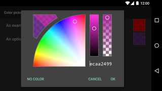
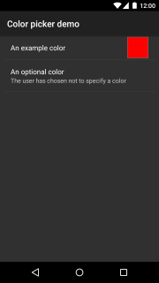

# HSV-Alpha Color Picker for Android

This library implements a color picker and a color preference for use in Android
applications.

  

## Features

I couldn't find this combination of features in an existing library, which is why I wrote this one:

* Alpha slider.
* Copy / pasteable text field.
* Old and new colors displayed side by side.
* Selection of "no color".
* Proper behavior when orientation changes.
* Up-to-date design.

In addition, the Hue-Saturation picker...

* gives higher hue precision than a square picker of the same size.
* allows easier selection of pure white than a circular picker.

## ColorPreference Usage

Add the *colorpicker* library to your project and add the *ColorPreference* to your preference
screen xml:

    <PreferenceScreen
        xmlns:android="http://schemas.android.com/apk/res/android"
        xmlns:colorpicker="http://schemas.android.com/apk/res/com.rarepebble.colorpicker">

        <com.rarepebble.colorpicker.ColorPreference
            android:key="simplePreference"
            android:title="@string/pref_title"
            colorpicker:defaultColor="#f00"
            />

    </PreferenceScreen>

To use the "optional color" functionality, specify a button label for the "no colour" button:

        <com.rarepebble.colorpicker.ColorPreference
            android:key="optionalColor"
            android:title="@string/pref_optional_color"
            colorpicker:noneSelectedSummaryText="@string/no_color_selected"
            colorpicker:selectNoneButtonText="@string/no_color"
            />

You can also specify some summary text to be shown when there is no color chosen, as in the example
here. The "No color" choice is saved by removing the saved preference, so use
*SharedPreference.contains("myOptionalColor")* to test for that.

## ColorPickerView Usage

You can construct a *ColorPickerView* in the usual way, either in code or in a layout. Get and set
the color in the conventional way:

    final ColorPickerView picker = new ColorPickerView(getContext());
    picker.setColor(0xff12345);
    ...
    final int color = picker.getColor();

Refer to the [ColorPreference source](colorpicker/src/main/java/com/rarepebble/colorpicker/ColorPreference.java)
for a fuller example.

## Bugs

Please report bugs in the GitHub [issue tracker](issues/).

## License

Licensed under the Apache License, Version 2.0 (the "License");
you may not use this file except in compliance with the License.
You may obtain a copy of the License at

http://www.apache.org/licenses/LICENSE-2.0

Unless required by applicable law or agreed to in writing, software
distributed under the License is distributed on an "AS IS" BASIS,
WITHOUT WARRANTIES OR CONDITIONS OF ANY KIND, either express or implied.
See the License for the specific language governing permissions and
limitations under the License.
